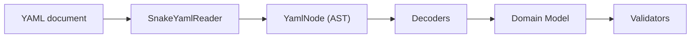

# Architecture

```mermaid
flowchart LR

    YAML["YAML document"]

    Reader["SnakeYamlReader"]

    AST["YamlNode (AST)"]

    Decoder["Decoders"]

    Domain["Domain Model"]

    Validator["Validators"]

    YAML --> Reader
    Reader --> AST
    AST --> Decoder
    Decoder --> Domain
    Domain --> Validator
```
